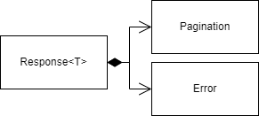

# Request-Response Model

## Request

Request will send any data structure as needed.

## Response

<figure><figcaption>
Generic response
</figcaption></figure>

The content is contextual. For example, if the frontend requests a list with all the employees then the content will be said list. If the request fails for any reason, then the content will be the failure context.

### Extensions

<figure><figcaption>
Response extension
</figcaption></figure>

Extension through composition. This way any new feature can be added as an optional structure, reducing impact to a minimum.
