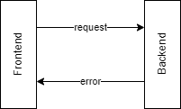

# Request Errors

<figure><figcaption></figcaption></figure>

This is oriented to a frontend-backend communication, so only those errors which occur when the backend processes a request matter here. The errors will be split between the frontend and backend, depending on who can handle them.

* Failures are those errors which the frontend can fix.
* Internal errors are those errors detected in the backend which the frontend can't fix.

## Failures

Invalid requests which the frontend can fix.

### Validation failure

<figure><figcaption></figcaption></figure>

Sent invalid info, which should be corrected. For example, tried to add information for a user which doesn't exist.

## Internal Error

Backend errors. Can't be fixed by the user or the client.

### Fatal errors

<figure><figcaption></figcaption></figure>

Can't be fixed by the backend or the frontend. The backend just informs of this.

### Fixable errors

These can be ignored. When the backend finds an error which can be fixed automatically, then no error response will be generated.
