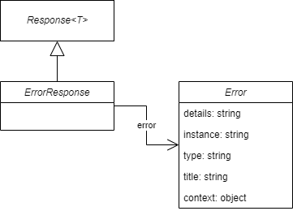

# Response

Based on [application/problem+json](https://www.rfc-editor.org/rfc/rfc7807).

<figure><figcaption>
Error response model
</figcaption></figure>

Each error response will contain a single error.

