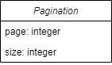

# Request

<figure><figcaption>
Pagination model
</figcaption></figure>

## Sort

Pairs of property and direction. These are used to sort the requested data.

Direction is one of:

* Ascending
* Descending

By default the direction is always ascending.

## Pagination

Specifies the page and page size for the request.
