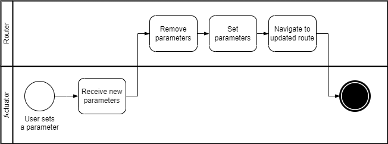
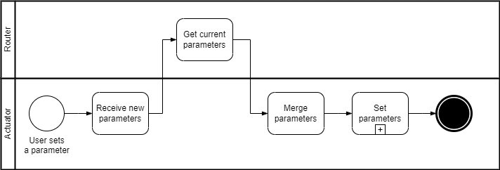
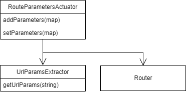

# Actuator

Reacts to these events:

* User activates UI

Does:

* Updates route with parameters

The actuator is called by the user, through buttons or any other UI component, such as pagination navigation. The new parameter is added to the URL.

This change implies reloading the view.

## Flow

### Setting parameters

<figure><figcaption></figcaption></figure>

### Adding parameters

<figure><figcaption></figcaption></figure>

## Model

<figure><figcaption>
Route parameters actuator
</figcaption></figure>
