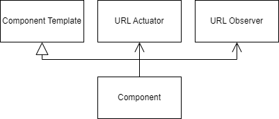

# Example Component

A component requires of these pieces.

<figure><figcaption>
Example component
</figcaption></figure>

* Template, containing the layout and basic events
* Component, extending the template to add business logic
* URL actuator, to change the URL parameters
* URL observer, to update itself with the URL parameters
