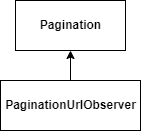

# Observer

An URL observers allows reacting to changes on the URL pagination parameters.

<figure><figcaption>
Pagination Observer
</figcaption></figure>

## Use

* Give the pagination data when it changes on the URL
* Handle listeners waiting for changes

## Flow

When those parameters change:

* A new pagination object is prepared
* All listeners are called

## Data

* Full pagination data
