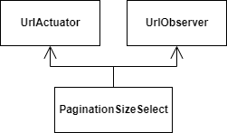

# Page Size Selection

The page size selector does what it says. It sets the size of the requested pages.

<figure><figcaption>
Pagination Size Selector
</figcaption></figure>

## Use

* Change the pagination size
* Update when the pagination size is changed

## Flow

When the user changes size:

* The actuator updates the route parameters

When the URL pagination parameters change:

* The navigation updates the data shown

## Data

* Range of possible sizes
* Selected size
