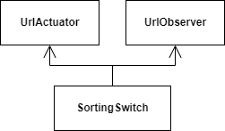

# Order Switch

Sorts a property on a click. Cycles between all the sorting status, including unsorted.

<figure><figcaption>
Order Switch
</figcaption></figure>

## Use

* Change a property sort direction
* Update when the page is changed

## Flow

When the user navigates to another page:

* The actuator updates the route parameters

When the URL pagination parameters change:

* The navigation updates the data shown

When the user clicks:

* Cycles between ascending, descending and unsorted

## Data

* Property being sorted
* Sorting direction
