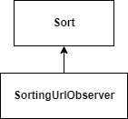

# Observer

<figure><figcaption>
Sorting Observer
</figcaption></figure>

## Use

* Give the sorting data when it changes on the URL
* Handle listeners waiting for changes

## Flow

When those parameters change:

* A new sort object is prepared
* All listeners are called

## Data

* Full sorting data
