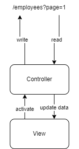

# Storing Queries in the Route

We want to define the current query inside the URL route. Allowing the reuse of URLs to arrive always at the same view. Of course, this doesn't meant that the view will always show the same data, we are talking about about, for example, having a URL to arrive at the second page.

Useful for:

* Storing data we want to keep between visits

Which data can be stored in the URL?

* Page (page number, page size)
* Sort (fields, direction)
* Query (field, comparison, value)

## Flow

This works with two distinct flows. One for updating and another for reading. While both are handled by the controller, and both are bound to interactions in the view, they are to be kept isolated. The only way they can interact is through the URL.

<figure><figcaption>
URL flow
</figcaption></figure>

Using pagination as the example. When a user request a page this changes the URL. Then the controller reacts to this change, reads the page and updated the data.

So we have two steps in a circular flow:

* Write URL parameters
* Read URL arguments and update data

### Writing parameters

Done by the user. When using an UI component.

1. User makes use of an actuator (next page)
2. URL is updated (set page number)
3. New URL argument is read (page number)
4. Data is updated (read for page)

### Reading parameters

Done automatically, when loading a URL.

1. URL argument is read (page number)
2. Data is read (read for page)

## Cases

### Loading a view for the first time

1. Route: /employees
2. Read route arguments
   1. No arguments
3. Request with no arguments (initial request)
   1. Loads initial values from the request
4. Final route: /employees

### Changing page

1. Route: /employees
2. Update page argument
   1. Read current page (page 0)
   2. Increase page value (page 1)
   3. Set page argument
3. Move to route: /employees?page=1
4. Reload view
5. Final route: /employees?page=1

### Load a view with arguments

1. Route: /employees?page=1
2. Read route arguments
   1. Page 1
3. Request using these arguments
4. Final route: /employees?page=1
