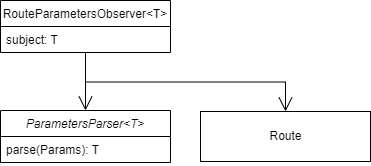

# Observer

<figure><figcaption>
Route parameters observer
</figcaption></figure>

## Flow

On build:

* Add listener to route. When the parameters change:
  * Send parameters to parse
  * Set parse result into subject
