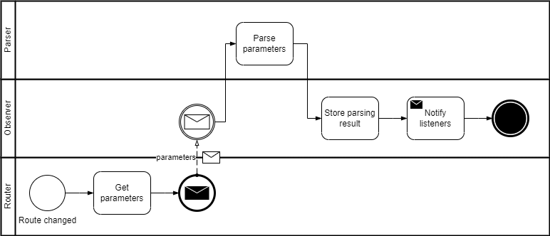

# Observer

<figure><figcaption>
Reacting to URL changes
</figcaption></figure>

Reacts to these events:

* When the URL route changes

Does:

* Sends change event

This means that an initial request may be needed, to set the default values.

## Flow

<figure><figcaption>
Parameter observer flow
</figcaption></figure>

The observer subscribes to changes on the route parameters, and catches them to be parsed and stored. As the observer is observable any change on the stored data is notified to any listener.

## Model

<figure><figcaption>
Route parameters observer
</figcaption></figure>
