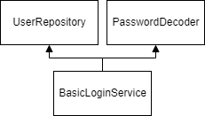

# Basic Login Service

<figure><figcaption>
Basic login service classes
</figcaption></figure>

## Flow

1. Validate login
2. Return status

## Validations

* Validate user exists
* Validate password matchs existing
* Validate user status (not disabled)
