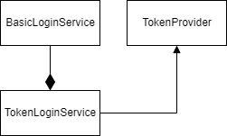

# Token Login Service

<figure><figcaption>
Login service classes
</figcaption></figure>

## Flow

1. Validate login through the basic login service
2. If valid, generate token
3. Return login status
