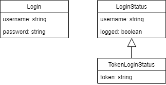

# Request-Response Model

<figure><figcaption>
Login model
</figcaption></figure>

The LoginRequest is, as it says, the request for a log in attempt.

LoginStatus is the response after that login attempt. Mainly it tells of the attempt was successful or not, through the logged flag. But it may contain additional info, such as authentication tokens.

