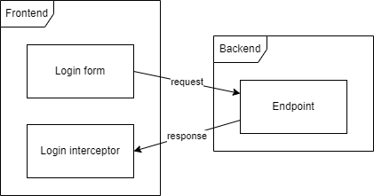

# Request-Response

## Flow

<figure><figcaption></figcaption></figure>

The frontend sends a request for a login attempt. Receiving the response with the status of said login attempt.

This response will contain all the authorization data required by the frontend. Such as authentication tokens. All calculations or operations are handled by the backend.

## Model

<figure><figcaption></figcaption></figure>

The LoginRequest is used on the request.

LoginDetails is the response returned after the login attempt. If the attempt failed then the logged flag is set as false.
