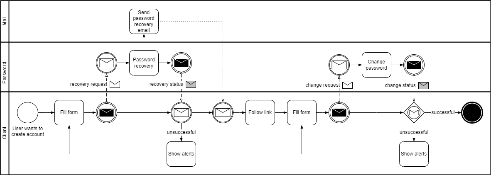

# Password reset

Creates a new password for an existing user.

## Use cases

Existing user wants to:

* Replace his password with a new password, without logging in

### Extensions

* The user can identify himself with the username
* The user can identify himself with the email

## Flow

<figure><figcaption>
Password reset request flow
</figcaption></figure>

The first part is started by the user.

1. User requests password reset
   * Identified himself with the username
   * Or with the password

The second part is started by the user from the received email.

1. User follows link with one use code
2. User creates new password
   * Password written twice and compared
3. Frontend handles status response

## Model

<figure><figcaption>
Password reset model
</figcaption></figure>
