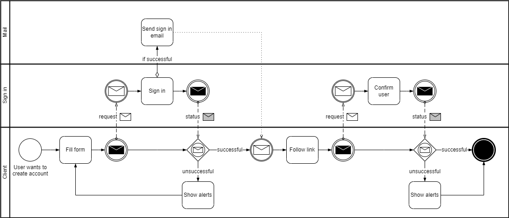

# Sign Up

Creates a new user for the application.

## Flow

<figure><figcaption>
Sign up flow
</figcaption></figure>

The first part is started by the user.

1. User fills form
2. Sign up request is sent to the backend
   * Request is validated
   * If valid, the user is created. Disabled and without password
   * Email is sent with next step
   * Sign up status is returned to the frontend
3. Frontend handles status response
   * If successful, this step is finished

The second part is started by the user from the received email.

1. User follows link with one use code
2. User confirms user creation and creates password
   * Password written twice and compared
3. User confirmation is sent to the backend
4. Frontend handles status response

## Model

<figure><figcaption>
Sign up model
</figcaption></figure>
