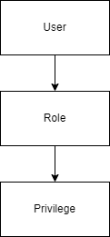

# User - Role - Privilege

A simple user security model. A user has roles, and these roles have privileges.

<figure><figcaption></figcaption></figure>

## Authentication

The user is used for authenticating. Each existing user actor has a user instance in the system.

## Authorization

Privileges are used for authorization. Any action watched by the security layer is associated to a privilege.

Privileges are grouped in roles. Users can't receive privileges directly, instead they get one or more roles.

## Example

We have an endpoint which allows registering new employees. This requires the "CREATE\_EMPLOYEE" privilege.

If a user wants to create an employee then he needs a role with the "CREATE\_EMPLOYEE" privilege.
