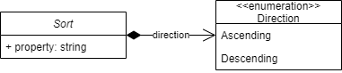

# Model

<figure><figcaption>
Pagination model
</figcaption></figure>

Pairs of property and direction. These are used to sort the requested data.

Direction is one of:

* Ascending
* Descending

By default the direction is always ascending.

